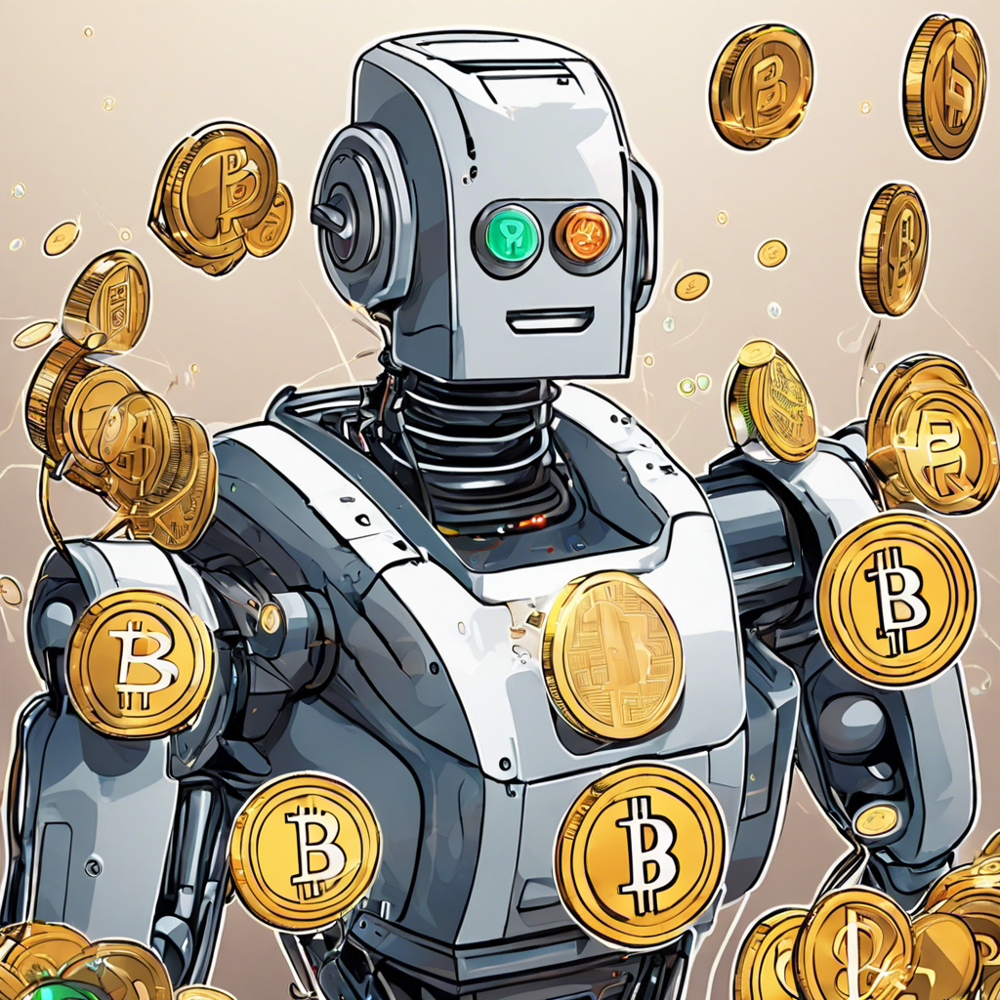

# Motema on My Mind
There's a monster that haunts me as a consumer of electronics. It's the reality that a large portion of my human experience is built on a foundation of corruption, deceipt, and greed. Around 2017, when I had a sudden urge and intent to know how the world works, I learned about the atrocities Belgium brought to Congo for the rubber trade. I was sick to my stomach when I found out that, as a software engineer, I am no better than a car manufacturer who increased the demand for rubber and indirectly exacerbated the exploitation of the people and resources in the Congo. 

I was even more disappointed when I realized that because of the natural wealth of the Congo and its history of corruption (was it ever really free? What of Lumumba?), it is still unjustly losing in the game of economics. In a truly free market system, surely a country with the natural resources of Congo would be a leading economy. Since this is not the case, diving deeper into history one can plainly see that corruption was weaved into the borders that were drawn by those greedy boys with bodies of men. None of the independent former colonies of Africa were meant to be truly free. That was the joke, that was the April fool, that was the "aha" that led to bright clarity and imminent rage. It took me years to beat that rage, and with a clear mind I do my duty to help. 

This time around, I've concluded, is different. It's ironic to me how I was educated and made aware on a device that was made with the mineral these injustices are done over. I thought of how Belgium was able to commit genocide for 50 years with most of the world not knowing or caring (and perhaps even justifying it due to the disease of manifest destiny). I also thought of how those same crimes were hidden by systems that control information, such as the system I was grew up in that never mentioned this crime along with others like the Holocaust. Now that we have the technology that this mineral creates, it's difficult to paint the picture with black and white. Now the average human has more capacity and information to solve these problems. Most people I come across are, in fact, at least aware of the issue, and stand in support of justice. The hard part is harnessing collective and organized action. 

I decided to stop feeling guilty about it and just do something.

### Research
I started by talking to my friends D and J, who are of Congolese descent. I was able to learn what it is actually like in Congo, one of my friends had been to Kinshasa. Both of their families also know Lingala, the native language of most of the people who live in the DRC. The word "Motema" is Lingala for "heart," and I was able to confirm this translation with them. They both resonated with the project, but deeper conversations were had after the implementation was done. After studying a bit of Lingala and the various peoples in the country (actually learned about the Bantu's migrations here, what an [expansive](https://www.worldhistory.org/Bantu_Migration/) tribe!), I dove into the mining crisis. I discovered and watched this [video](https://youtu.be/ff_qrTyjr1o?si=qnVD0p2Y2crbHtNp) with Siddarth Kara elaborating on "Blood Cobalt". The video is worth every minute, and it lit a fresh fire in me to at least do *something*.

In the video, one of the tragedies was one of a boy named Raphael who died in the mines; he was forced to give up education to support the family. I thought, what if miners could get paid more to afford to feed their families and send their kids to school? Realistically, the most ideal solution to this problem is to educate Congolese children so they can take advantage of their country's mining industry and engineer safe mines and environmentally extraction methods. This would help the country's GDP phenomenally, and as we know about economics, once the revenue is steady, mercantilism can handle the rest and catapult the DRC into being one of the most thriving economies in the world. Not to mention, most of the toxins people are exposed to around the mines would be ameliorated if the facilities were engineered better. Those that built these mines, however, have no care for the human lives around the mines.

Many efforts have been made to provide support by spreading awareness and protesting. Though I genuinely feel that protest is not as effective in today's age. I think that the world's problems can only be solved with efficient industrialism that can outcompete the bastards who set up this system of inequality in the first place. A protest may spread awareness, but the people who have the power to change anything are already fully aware of and are often times the cause of such atrocities. What's the good of 2 million people in Chicago knowing about the situation when nobody will actually do anything anyways? Even if regulators listen, they are all susceptible to lobbying. Cobalt is too valuable. Politicians with good intent will get ignored because money rules today, not people. We don't have regulations, we have money (halfway joking 😉 )! And regulation is designed to protect people's money, not necessarily people (see war and slavery). This is just logic! Another approach is to donate lots of money to the cause. Though this may be the most effective, simply donating is often times not the best solution. I'll dive into an example later, but in essence it's best to *know* that the money is going straight to the miners. Nonprofits with bad intentions pop up everywhere. Not to say there aren't nonprofits with good intentions, but I have learned to always verify, never trust.

My reasoning stemmed from prior experience. I donated $50 to a foundation that claimed they supported people in the Congo. They are activists and support those affected by mining injustices and the M23 rebellions. However, after my donation was completed, I had no idea where my money went. In fact, the email that I sent specifying what I want to help with may have gone missing or ignored, because I didn't receive a response. The company may be doing wonderful work in the field, but how do I *know* my money went to miners and not the pockets of middle men? I have no idea, and likely will be in the dark for some time. 

### Execution

Sometimes I feel like I could be forcing it with solving problems with blockchain, but this one actually makes sense, hear me out. I knew that decentralizing mining (worth a brainstorm session) and bringing justice to the workers wouldn't happen overnight. I also resolved that the best way to remedy the problem in the short term is to give people the ability to donate to miners directly, with the money passing as few hands as possible (ideally none). I started thrashing Perplexity with questions about cobalt mining and the economics of the Congo and the mining industry. I was able to figure out that there are typically uranium traces in the cobalt mines. This is terrible for the miners, but it could be key in solving the problem of direct donations. Direct donations can, indeed, help miners afford equipment that protects them from such radiation.

I knew that radiation could be sensed with a [geiger counter](https://www.youtube.com/watch?v=Y15lHe5pTzo). Any way to get this data on the blockchain would be helpful in achieving direct donations. Working in zero knowledge machine learning, we do exaclty this. You can run a machine learning model, prove it was done correctly (with a [zk proof](https://www.youtube.com/watch?v=HUs1bH85X9I)), then put the result on the blockchain and perform some task. The reason we do this is so that we don't have to pay the expensive gas fees for computation on a blockchain. Also, we need to somehow trust the data that is coming to the smart contract on the blockchain. If my smart contract handles payments, how do I trust the data that tells me to pay a certain account? With these truths, I figured what if a computer could prove that a cobalt miner was indeed a cobalt miner? This is the premise of Motema: once you can prove a miner is indeed a miner, then you can interact with them through trustless systems and get them donations with **no** middle men. Unfortunately the implementation wasn't fully trustless. I didn't get a geiger counter that has a microprocessor that could cryptographically sign data (though this is possible). Though, for the hackathon, a cheap geiger counter with my Flipper Zero was enough for the proof of concept (pictured below). This was the major trust assumption; the computation on the data itself is all [proven](https://github.com/lancenonce/motema/blob/main/zkml_geiger/ML_third_attempt/motema_three/inference/src/lib.cairo). 

A trustless system is something like a blockchain, where you don't need to trust human beings to execute what you want to get done. Blockchains like Ethereum work as expected without the need to trust because the people who run the blockchain typically have tons of money invested that they'll lose if they break the [rules](https://www.youtube.com/watch?v=M3EFi_POhps). This security and assurance of execution would make the perfect channel for extra income for miners. With assumed trust from the geiger counter, the trust from the zk proof of processing (determining if the geiger counter data read a valid miner or not), and the blockchain pool of donation funds, we had a pretty robust concept on our hands.

Motema proposes a means of donating directly to miners without middle men. Since the funds are stored in a [smart contract](https://github.com/lancenonce/motema/blob/main/contracts/MotemaPool_flattened.sol), when miners prove that they are miners, they can claim *directly* from the pool of donations. No hand-to-hand-to-hand-to-hand nonsense. All they need to do is prove that they are a miner, which is when the geiger counter comes in. We take the read of the sensor, prove that a unique human being created that trace (one iteration of the project used [Worldcoin](https://github.com/armsves/MotemaWorld/blob/main/src/pages/verify-miner.tsx#L103) for this, though I still am researching their hardware to see if it's trustworthy), then issue a payout automatically that sends crypto from the smart contract on the blockchain to the miner's crypto wallet (assuming they have one or can create one with ease with [Account Abstraction](https://blog.thirdweb.com/account-abstraction-erc4337/)).

I was ultimately able to work with [Armando Medina](https://www.linkedin.com/in/armsves/) during ETH Oxford and London to build Motema. Though I was there representing my company Giza (for hackathon support and speaker positions), I knew I wanted to participate in the hackathon and build Motema. I'm happy to say that we made the project a reality and did well at both hackathons! You can see a demo [here](https://youtu.be/7o453t2d-CE) and the repository [here](https://github.com/lancenonce/motema).

### Show me the incentive
One of my favorite quotes of all time is Charlie Munger's "show me the incentive, and I'll show you the outcome." The hacky solution for Motema, though technically solid, simply was not realistic. When people scan for radiation, it's rather easy for them to purposefully expose themselves to some uranium and get paid without mining. Also, we don't want the Congolese economy to be *more* reliant on providing miners, we want more Congolese engineers, manufacturers, etc. The focus is on freeing the people, but only they can free themselves. Our job is to just open more opportunities for them. Does getting paid more for mining do this in the most effective way? I don't think so.

Though I think the project helped spread awareness at Oxford and in London, I don't think that pure engineering can be used to solve problems like this. We need a strong why behind the engineering systems that we build, a strong incentive mechanism. I love blockchains because once these are imagined, they're easy to implement. However, what do we want to incentivize people to do here?

If we incentivize radiation exposure, we don't solve the problem (in fact, we can exacerbate it). If we incentivize mining, we don't solve the problem. There is a caveat here, though, because if we incentivize *ethical* mining, that could help solve *some* issues. However, I think the final solution is deeper than this.

This solution exists. Every problem has a solution. However, I don't think that answer is hidden in the depths of a complex engineering system. I think it's hidden in the hearts of Congolese people, their (our) Motema. I know there are people there who have thought of solutions for their nation, who just don't have the voice or resources to implement it. I think my time would be better spent looking to meet those people than solve a problem I don't know enough about.

### Next Steps
I would love to go to the DRC, but I know that this isn't such an easy task. It would be great to go there and learn from the people and discover their root problems. Also, I'm totally down to talk to people who know this problem well and want to brainstorm ideas. I'm here to help and though I'm a software engineer, I want to end the oppressive systems and pay the fair market price for the valuable metals we use. I'm an industrialist indeed, but a fair one. I cannot stand for injustice.